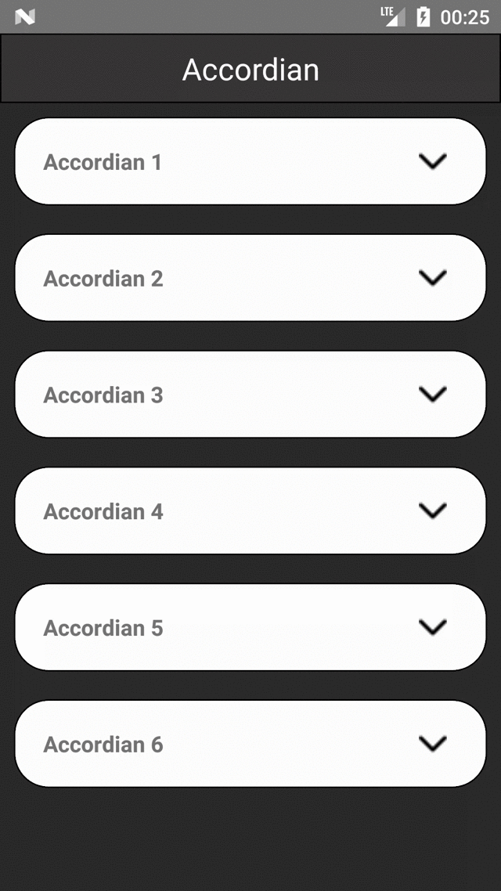

# react-native-simple-accordian

_Animated collapsible component for React Native_

Pure JavaScript, supports dynamic content heights and components that is aware of its `collapsed` state (good for toggling arrows etc) with custom styling.

## Installation

```
npm install --save react-native-simple-accordian
```

## Accordion Usage

This is a convenience component for a common use case,you can see demo below.

```js
import SimpleAccordion from 'react-native-simple-accordian';
<SimpleAccordion
  sections={['Accordian 1', 'Accordian 2', 'Accordian 3']}
  renderSectionTitle={this._renderSectionTitle}
  renderHeader={this._renderHeader}
  renderContent={this._renderContent}
/>;
```

## Properties

| Prop                                                    | Description                                                                                                     |
| ------------------------------------------------------- | --------------------------------------------------------------------------------------------------------------- |
| **`sections`**                                          | An array of sections passed to the render methods                                                               |
| **`renderHeader(content, index, isActive, sections)`**  | A function that should return a renderable representing the header                                              |
| **`renderContent(content, index, isActive, sections)`** | A function that should return a renderable representing the content                                             |
| **`renderSectionTitle(content, index, isActive)`**      | A function that should return a renderable representing the title of the section outside the touchable element  |
| **`onChange(index)`**                                   | An optional function that is called when currently active section is changed, `index === false` when collapsed  |
| **`initiallyActiveSection`**                            | Set which index in the `sections` array is initially open. Defaults to none.                                    |
| **`activeSection`**                                     | Control which index in the `sections` array is currently open. Defaults to none. If false, closes all sections. |
| **`underlayColor`**                                     | The color of the underlay that will show through when tapping on headers. Defaults to black.                    |
| **`touchableComponent`**                                | The touchable component used in the Accordion. Defaults to `TouchableHighlight`                                 |
| **`touchableProps`**                                    | Properties for the `touchableComponent`                                                                         |
| **`disabled`**                                          | Set whether the user can interact with the Accordion                                                            |
| **`align`**                                             | See `Collapsible`                                                                                               |
| **`duration`**                                          | See `Collapsible`                                                                                               |
| **`easing`**                                            | See `Collapsible`                                                                                               |
| **`expandFromBottom`**                                  | Expand content from the bottom instead of the top                                                               |
| **`style`**           | Optional styling for the container                                                                                                                 |        
## Demo



## Example

```
npm install --save react-native-simple-accordian lodash
```

```js
import React, { Component } from 'react';
import { StyleSheet, Text, View, TouchableOpacity,Image,Dimensions,ScrollView } from 'react-native';
import SimpleAccordion from 'react-native-simple-accordian';
const deviceWidth = Dimensions.get('window').width
const accordianData = 'This is sample Accordian Text....';
import * as _ from 'lodash'

const sampleAccordianData = [
  {
    title: 'Accordian 1 ',
    content: accordianData
  },
  {
    title: 'Accordian 2',
    content: accordianData
  },
  {
    title: 'Accordian 3',
    content: accordianData
  },
  {
    title: 'Accordian 4 ',
    content: accordianData
  },
  {
    title: 'Accordian 5',
    content: accordianData
  },
  {
    title: 'Accordian 6',
    content: accordianData
  },
  
];

export default class AccordianExample extends Component {
    constructor(props){
        super(props)
        this.state = ({
            content:'',
            open: false,
        });
    }

  onChangeAccordian(section) {
    this.setState({ open: section });

  }

  renderHeader(section, i, isOpen) {
    return (
      <View style={{backgroundColor:'#ffffff',flexDirection:'row'}}>
        <Text style={[styles.headerText,{width:deviceWidth-80,padding:10,textAlign:'left'}]}>{section.title}</Text>
      </View>
    );
  }

  renderContent(section, i, isOpen) {
    return (
      <View style={styles.content}>
        <Text>{section.content}</Text>
      </View>
    );
  }

  render() {
    return (
      <View style={{flex: 1,}}>
        <View style={styles.headerTextView}>
          <Text style={styles.headerText1}>Accordian</Text>
        </View>
        <View style={styles.container}>
          <ScrollView >    
            <SimpleAccordion
              style= {{
                borderWidth:1,
                borderRadius:25,
                margin:10,
                padding:10,
                backgroundColor:'#ffffff'
              }}
              activeSection={this.state.open}
              sections={sampleAccordianData}
              touchableComponent={TouchableOpacity}
              renderHeader={this.renderHeader}
              renderContent={this.renderContent}
              duration={1000}
              onChange={this.onChangeAccordian.bind(this)}
            />
          </ScrollView>
        </View>
      </View>
      
    );
  }
}

const styles = StyleSheet.create({
    container: {
      flex: 1,
      justifyContent: 'center',
      backgroundColor:'#2c2c2c'
      
    },
    headerText1:{
      color:'white',
      textAlign:'center',
      fontSize:22
     
    },
    headerTextView:{
      height:50,
      borderWidth:1,
      backgroundColor:'#383636',
      justifyContent:'center',
    },
    title: {
      textAlign: 'center',
      fontSize: 22,
      fontWeight: '300',
      marginBottom: 20,
      color:'#ffffff'
    },
    header:{
        flex:1
    },
    headerText: {
      textAlign: 'center',
      fontSize: 16,
      fontWeight: '500',
    },
    content: {
      padding: 20,
      backgroundColor: '#ffffff'
    },
  });
    
```
